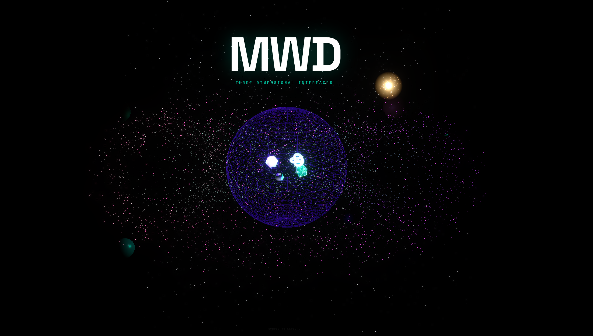

# MWD — Three Dimensional Interfaces



An experimental WebGL environment built entirely in the browser. No game engine, no external 3D assets — everything is procedural geometry, custom GLSL shaders, and physically-based materials rendered in real time via Three.js.

Scroll through four distinct scenes: a holographic projection room, a torus particle storm, a material studies chamber, and deep space. A procedural spaceship flies a continuous loop through the environment.

---

## Scenes

| Scene | Effect |
|---|---|
| **Hologram Room** | Custom scanline ShaderMaterial, flickering ghost overlay, orbital particle ring |
| **Particle Storm** | 8,000-point torus field, mouse repulsion, additive color blending |
| **Material Studies** | Iridescent/transmission glass, metallic PBR, UnrealBloomPass glow |
| **Deep Space** | Star field, wireframe sphere enclosure, supernova pulse, planets |

---

## Stack

- [Three.js r158](https://threejs.org/) — 3D rendering, geometry, shaders
- [GSAP ScrollTrigger](https://gsap.com/docs/v3/Plugins/ScrollTrigger/) — scroll-driven camera
- Custom GLSL — scanline fragment shader, hologram flicker
- `MeshPhysicalMaterial` — iridescence, transmission, bloom
- `UnrealBloomPass` via `EffectComposer` — post-processing glow
- No build tools. Runs directly from `index.html`.

---

## Run locally

Requires any static file server (ES modules don't work from `file://`).

```bash
# Option 1 — npx serve (no install)
npx serve . -p 4326

# Option 2 — Python
python -m http.server 4326

# Option 3 — VS Code Live Server
# Right-click index.html → Open with Live Server
```

Then open `http://localhost:4326` in a browser with WebGL2 support (Chrome/Firefox/Edge).

---

## Controls

- **Scroll** — moves the camera through the environment
- **Mouse move** — parallax tilt on camera, particle repulsion in storm scene

---


